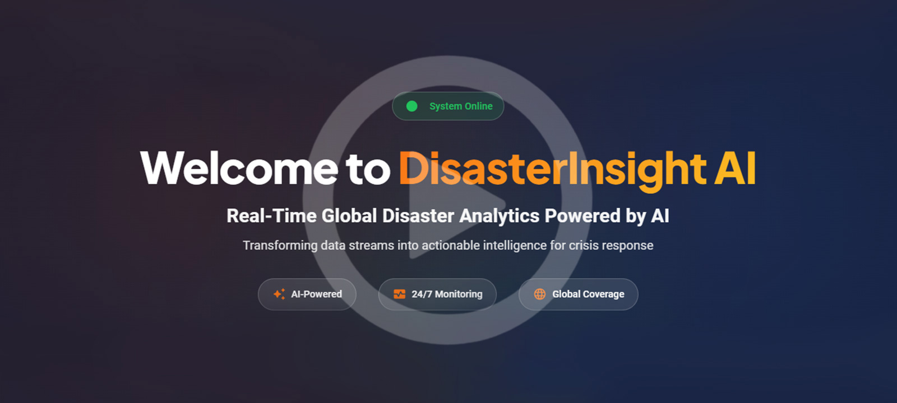
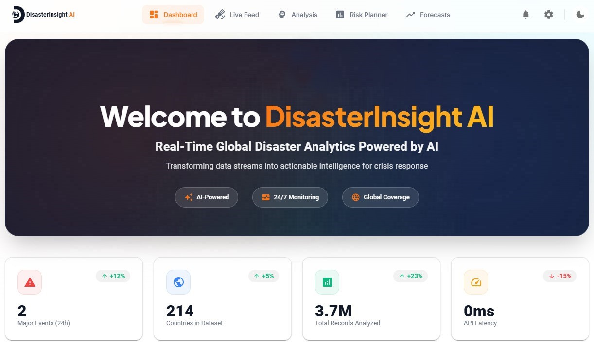
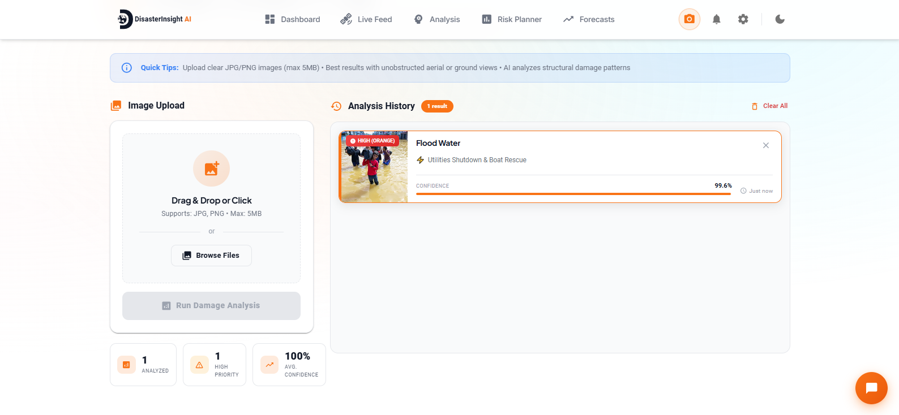
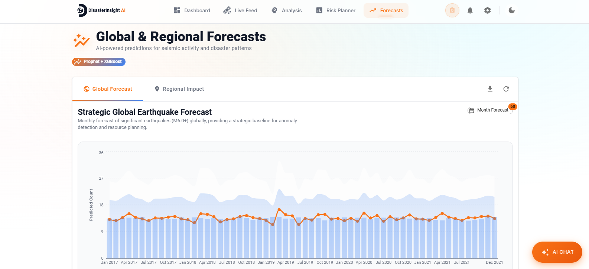
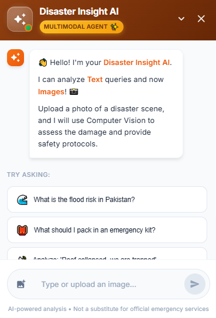
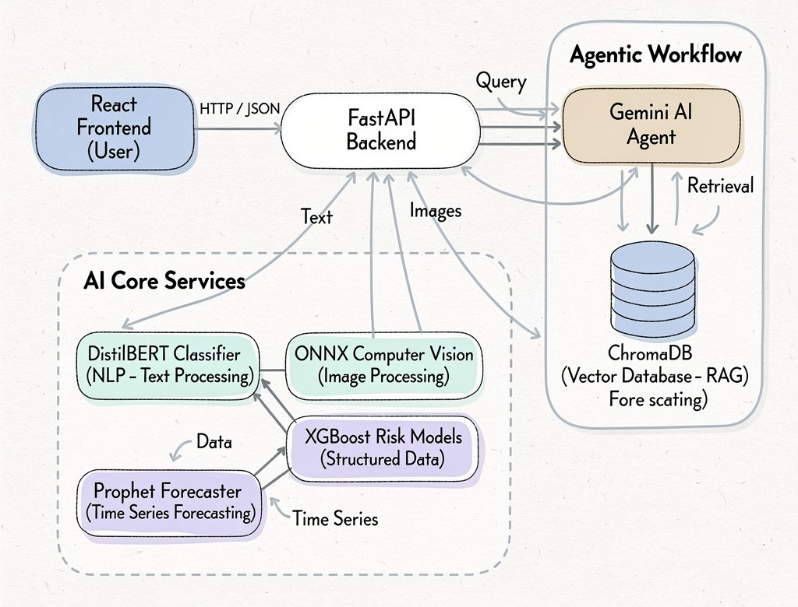

<p align="center">
  <picture>
    <source srcset="./disaster-insight-frontend/src/assets/logos/logo-dark.svg" media="(prefers-color-scheme: dark)">
    
  </picture>
</p>

<h1 align="center">DisasterInsight AI Platform</h1>

<p align="center">
  <strong>Multimodal AI System for Real-Time Disaster Analytics & Response.</strong>
  <br />
  Combines NLP, Computer Vision, Agentic RAG, and Predictive Modeling to transform chaotic data into actionable intelligence.
</p>

<p align="center">
  
  
  
  
</p>

---

<div align="center">

## 🚀 Live Deployment

The platform is fully deployed and available for real-time testing:

| Component | Status | Link |
| :---: | :---: | :---: |
| **Production Web App** |  | [disaster-insight-ai.vercel.app](https://disaster-insight-ai.vercel.app/) |
| **Backend API (Swagger)** |  | [zainafxal-disaster-insight-api.hf.space/docs](https://zainafxal-disaster-insight-api.hf.space/docs) |

> **Note:** The backend is hosted on Hugging Face Spaces (Free Tier). If the site takes a few seconds to load initially, it's just the server "waking up" from a cold start.

</div>

---


## 📌 Overview

During a disaster, decision-makers are overwhelmed by unstructured data. **DisasterInsight AI** is an end-to-end platform that unifies diverse AI disciplines to solve this:
1.  **Sees** damage using Computer Vision.
2.  **Reads** crisis reports using NLP.
3.  **Predicts** future risks using Time-Series Forecasting.
4.  **Reasons** and plans using a Generative AI Agent with access to official protocols (RAG).

---

## 🎥 Project Demo Video: 
> Click the thumbnail below to watch a short demo of the platform.

[](https://youtu.be/qCLY11nclM4)

## SCREENSHOTS:
**Dashboard:**

<p align="center">
    
  </a>
</p>

**Auto-Triage of Disaster Imagery:**
<p align="center">
    
  </a>
</p>

**Forecasts:**
<p align="center">
    
  </a>
</p>

**Smart Chat Assistant (RAG based):**
<p align="center">
    
  </a>
</p>

---

## ✨ Key Features

This is not just a dashboard; it is an **Orchestration of 5 AI Modules**:

### 🤖 1. Multimodal AI Agent (GenAI + RAG)
-   **Brain:** Powered by **Google Gemini 2.0**.
-   **Tools:** The agent can autonomously call the Risk Model, Forecast Model, or search the database based on user queries.
-   **RAG (Retrieval Augmented Generation):** Queries a vector database (ChromaDB) of official PDF safety protocols to provide verified advice, eliminating hallucinations.

### 👁️ 2. Visual Damage Assessment (Computer Vision)
-   **Model:** Fine-tuned **MobileNetV2** (served via **ONNX Runtime** for low latency).
-   **Function:** Classifies uploaded images (e.g., "Major Damage", "Flood", "Fire") and automatically assigns a **Triage Priority** (Critical/High/Low).

### 🌐 3. Real-Time Signal Analysis (NLP)
-   **Model:** DistilBERT Transformer.
-   **Function:** Classifies social media streams into 10 humanitarian categories (e.g., "Rescue Needed", "Infrastructure Damage") in real-time.

### 📊 4. Strategic & Tactical Forecasting
-   **Global Forecast:** Uses **Prophet** to predict long-term seismic trends.
-   **Regional Impact:** Uses **XGBoost** to predict the probability of high-fatality events in specific high-risk zones.

---

## 📦 High-Level Architecture

```text
+------------------------+      +---------------------------+      +--------------------------+
|                        |      |                           |      |                          |
|   React Frontend       | ---> |     FastAPI Backend       | ---> |    4x AI / ML Models     |
| (Tailwind, Chart.js,   |      |    (Python, Uvicorn)      |      |  (Transformers, XGBoost, |
|      Mapbox GL)        |      |                           |      |    Prophet, ONNX CV)     |
|                        |      |                           |      |                          |
+------------------------+      +---------------------------+      +--------------------------+
```

## 🏗️ System Architecture

The system follows a **decoupled, microservices-ready architecture**, integrating AI models and agentic workflows.

<p align="center">
  
</p>


### Component Key Technologies
- **Frontend:** React, Tailwind CSS, Chart.js, Mapbox GL
- **Backend API:** Python, FastAPI, Uvicorn, Docker
- **AI & ML Models:** PyTorch, Transformers(DistilBERT), Scikit-learn, XGBoost, Prophet, ONNX CV Models
- **Data & Storage:** Pandas, Jupyter, ChromaDB (for RAG)
- **Agentic Workflow:** Gemini AI Agent orchestrating model calls & retrieval
- **Agentic Workflow:** Gemini AI Agent orchestrating model calls & retrieval

---

## 📑 Reports & Documentation

This repository includes comprehensive documentation for both end-users and developers.

*   **Project Summary Report:** A high-level overview of the project's objectives, methodology, and key results.
    > ➡️ **[Read the Full Project Report](./reports/PROJECT_SUMMARY_REPORT.md)**

*   **Model Performance Reports:** In-depth analysis of each of the four AI models, including metrics, confusion matrices, and feature importance.
    > ➡️ **[View Model Performance Reports](./reports/model_performance/)**

*   **Exploratory Data Analysis (EDA):** Reports on the initial data analysis that informed our modeling strategies.
    > ➡️ **[View EDA Reports](./reports/eda/)**

*   **Dashboard User Guide:** A detailed walkthrough of all features in the live web application.
    > ➡️ **[Read the User Guide](./disaster-insight-frontend/docs/USER_GUIDE.md)** 

---

## 🗺️ Repository Navigation

This monorepo contains all the code and assets for the DisasterInsight AI platform. Here's a guide to the key directories:

| Folder                    | Description                                                                                      |
|---------------------------|--------------------------------------------------------------------------------------------------|
| data                      | Instructions and links to download the datasets used for model training. (Data files are not included). |
| disaster-insight-api      | The high-performance FastAPI backend that serves the AI models.                                 |
| disaster-insight-frontend | The production-grade React frontend application. This is the main user interface.               |
| legacy_streamlit_ui       | The initial proof-of-concept dashboard built with Streamlit. Kept for historical/development reference. |
| models                    | The central "model registry" containing the final, serialized model files ready for deployment. |
| notebooks                 | The Jupyter Notebooks detailing the R&D, training, and evaluation of all four AI models.        |
|reports	                  | (Start Here) Comprehensive project, model performance, and EDA reports.                         |
| visuals                   | A repository of charts and plots generated during the data analysis and model evaluation phases. |

---

## ⚙️ Setup & Installation

To run the entire platform locally, you will need to set up the backend and frontend separately.

### **Prerequisites**
- Git
- Conda / Python 3.9+
- Node.js 16+
- **Google Gemini API Key** (Free tier is sufficient)

### **1. Set Up the Data & Models**
The models and notebooks require training data which is not included in this repo.

➡️ Follow the instructions in the [data/README.md](data/README.md) to download the necessary datasets. The trained models are located in the `models/` directory.

### **2. Run the Backend API**
The backend API serves the models from the models directory.

➡️ Follow the setup instructions in the [disaster-insight-api/README.md](disaster-insight-api/README.md) to run the FastAPI server.

### **3. Run the Frontend Dashboard**
The frontend is the user-facing application.

➡️ Follow the setup instructions in the [disaster-insight-frontend/README.md](disaster-insight-frontend/README.md) to run the React app.

---

## 👨‍💻 About the Creator

**Muhammad Zain**  
*Data Scientist | AI Engineer | Applied ML Developer | LLM Developer*

[](https://github.com/zainafxal)
[](https://www.linkedin.com/in/zainafxal)
[](https://www.instagram.com/zainafxal)
[](https://www.kaggle.com/zainafxal)
[](https://huggingface.co/zainafxal)

---

## 📚 Datasets & Credits

The AI models in this project were trained on several publicly available datasets. We are grateful to the creators and maintainers of these resources.

➡️ For a complete list of datasets, sources, and their respective licenses, please see the [data/README.md](data/README.md).

## 📜 License

The source code for this project is licensed under the Apache License 2.0.

Please see the LICENSE file for the full text. This permissive license allows for commercial and non-commercial use, modification, and distribution.

### **A Note on Data Licenses:**
The datasets used to train the models are subject to their own original licenses, some of which are non-commercial. Please refer to the [data/README.md](data/README.md) for detailed information on data sources and their respective terms of use before using them for any purpose.