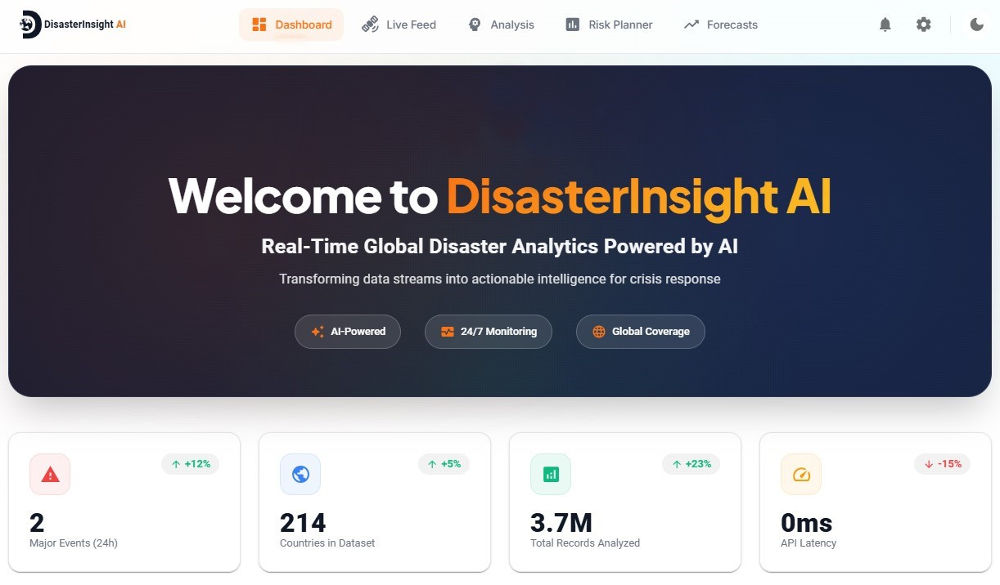

<p align="center">
  <picture>
    <source srcset="./disaster-insight-frontend/assets/logo-dark-BUBvcq5w.svg" media="(prefers-color-scheme: dark)">
    
  </picture>
</p>

<h1 align="center">DisasterInsight AI Platform</h1>

<p align="center">
  <strong>From Raw Data to Real-Time Actionable Intelligence.</strong>
  <br />
  An end-to-end, full-stack disaster analytics platform that leverages AI to detect, analyze, and forecast global disaster events.
</p>

<p align="center">
  <a href="https://huggingface.co/spaces/zainafxal/disaster-insight-webapp" target="_blank">
    
  </a>
  <a href="https://zainafxal-disaster-insight-api.hf.space/docs" target="_blank">
    
  </a>
</p>

<p align="center">
  <a href="#-overview">Overview</a> •
  <a href="#-key-features">Key Features</a> •
  <a href="#-tech-stack--architecture">Architecture</a> •
  <a href="#-repository-navigation">Repository Navigation</a> •
  <a href="#-setup--installation">Setup</a> •
  <a href="#-datasets--credits">Datasets</a> •
  <a href="#-license">License</a>
</p>

<p align="center">
  <a href="https://huggingface.co/spaces/zainafxal/disaster-insight-webapp">
    
  </a>
</p>

---

## 📌 Overview
[**Try Live Web App**](https://huggingface.co/spaces/zainafxal/disaster-insight-webapp)

During a natural disaster, information is chaotic. Emergency responders, NGOs, and governments are flooded with unstructured data from social media while trying to anticipate where the next high-impact event might occur. **DisasterInsight AI** was built to solve this problem by providing a unified platform that filters the noise from real-time data streams, quantifies risk based on historical patterns, and provides strategic forecasts to enable proactive planning.

---

## ✨ Key Features

This platform integrates four distinct AI models and a live data feed into a single, cohesive user experience.

*   **🌐 Real-Time Signal Analysis:** An NLP Transformer model classifies live social media text into 10 humanitarian categories, identifying critical information as it emerges.
*   **📈 Predictive Risk Planning:** An XGBoost model assesses the potential severity of a disaster event, providing a data-driven risk probability based on historical data.
*   **📊 Forecasting Suite:**
    *   **Strategic Global Forecast:** A Prophet time-series model provides a long-term forecast of global earthquake frequency, establishing a baseline for "normal" activity.
    *   **Tactical Regional Forecast:** A specialized XGBoost model predicts the near-term probability of a high-impact earthquake in four of the world's most vulnerable regions.
*   **📡 Live Global Monitoring:** An integrated, real-time feed from the USGS API displays significant earthquake events as they happen around the globe.
*   **🖥️ Professional Dashboard:** A polished, branded, and fully responsive **React** frontend with an intuitive dark mode and modern, interactive visualizations.


---

## 📑 Reports & Documentation

This repository includes comprehensive documentation for both end-users and developers.

*   **Project Summary Report:** A high-level overview of the project's objectives, methodology, and key results.
    > ➡️ **[Read the Full Project Report](./reports/PROJECT_SUMMARY_REPORT.md)**

*   **Model Performance Reports:** In-depth analysis of each of the four AI models, including metrics, confusion matrices, and feature importance.
    > ➡️ **[View Model Performance Reports](./reports/model_performance/)**

*   **Exploratory Data Analysis (EDA):** Reports on the initial data analysis that informed our modeling strategies.
    > ➡️ **[View EDA Reports](./reports/eda/)**

*   **Dashboard User Guide:** A detailed walkthrough of all features in the live web application.
    > ➡️ **[Read the User Guide](./disaster-insight-frontend/docs/USER_GUIDE.md)**

---


## 🛠️ Tech Stack & Architecture

DisasterInsight AI is built as a modern, decoupled, three-tier system, ensuring scalability and maintainability.

```text
+------------------------+      +---------------------------+      +--------------------------+
|                        |      |                           |      |                          |
|   React Frontend       | ---> |     FastAPI Backend       | ---> |    4x AI / ML Models     |
| (on Hugging Face)      |      |   (on Hugging Face)       |      | (Transformers, XGBoost...) |
|                        |      |                           |      |                          |
+------------------------+      +---------------------------+      +--------------------------+
```

### Component Key Technologies
- **Frontend:** React, Tailwind CSS, Chart.js, Mapbox GL
- **Backend API:** Python, FastAPI, Uvicorn, Docker
- **Data Science & ML:** PyTorch, Transformers, Scikit-learn, XGBoost, Prophet, Pandas, Jupyter
- **Deployment:** Hugging Face Spaces

---

## 🗺️ Repository Navigation

This monorepo contains all the code and assets for the DisasterInsight AI platform. Here's a guide to the key directories:

| Folder                    | Description                                                                                      |
|---------------------------|--------------------------------------------------------------------------------------------------|
| data                      | Instructions and links to download the datasets used for model training. (Data files are not included). |
| disaster-insight-api      | The high-performance FastAPI backend that serves the AI models.                                 |
| disaster-insight-frontend | The production-grade React frontend application. This is the main user interface.               |
| legacy_streamlit_ui       | The initial proof-of-concept dashboard built with Streamlit. Kept for historical/development reference. |
| models                    | The central "model registry" containing the final, serialized model files ready for deployment. |
| notebooks                 | The Jupyter Notebooks detailing the R&D, training, and evaluation of all four AI models.        |
|reports	                  | (Start Here) Comprehensive project, model performance, and EDA reports.                         |
| visuals                   | A repository of charts and plots generated during the data analysis and model evaluation phases. |

---

## ⚙️ Setup & Installation

To run the entire platform locally, you will need to set up the backend and frontend separately.

### **Prerequisites**
- Git
- Conda / Python 3.9+
- Node.js 16+

### **1. Set Up the Data & Models**
The models and notebooks require training data which is not included in this repo.

➡️ Follow the instructions in the [data/README.md](data/README.md) to download the necessary datasets. The trained models are located in the `models/` directory.

### **2. Run the Backend API**
The backend API serves the models from the models directory.

➡️ Follow the setup instructions in the [disaster-insight-api/README.md](disaster-insight-api/README.md) to run the FastAPI server.

### **3. Run the Frontend Dashboard**
The frontend is the user-facing application.

➡️ Follow the setup instructions in the [disaster-insight-frontend/README.md](disaster-insight-frontend/README.md) to run the React app.

---

## 👨‍💻 About the Creator

**Muhammad Zain**  
*Data Scientist | AI Engineer | Applied ML Developer | LLM Developer*

[](https://github.com/zainafxal)
[](https://www.linkedin.com/in/zainafxal)
[](https://www.instagram.com/zainafxal)
[](https://www.kaggle.com/zainafxal)
[](https://huggingface.co/zainafxal)

---

## 📚 Datasets & Credits

The AI models in this project were trained on several publicly available datasets. We are grateful to the creators and maintainers of these resources.

➡️ For a complete list of datasets, sources, and their respective licenses, please see the [data/README.md](data/README.md).

## 📜 License

The source code for this project is licensed under the Apache License 2.0.

Please see the LICENSE file for the full text. This permissive license allows for commercial and non-commercial use, modification, and distribution.

### **A Note on Data Licenses:**
The datasets used to train the models are subject to their own original licenses, some of which are non-commercial. Please refer to the [data/README.md](data/README.md) for detailed information on data sources and their respective terms of use before using them for any purpose.