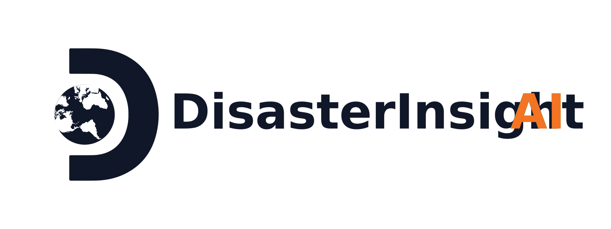
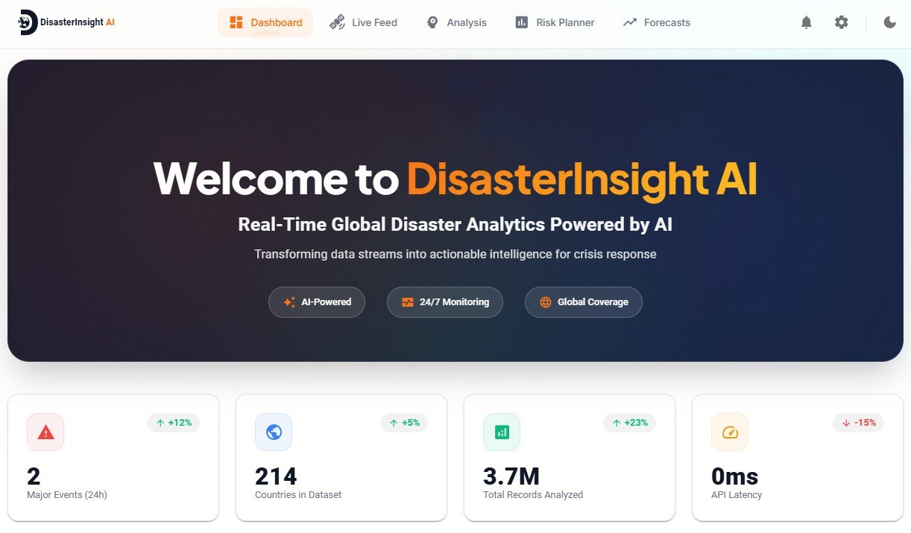

<p align="center">
  <picture>
    <source srcset="./src/assets/logos/logo-dark.svg" media="(prefers-color-scheme: dark)">
    
  </picture>
</p>


<h1 align="center">DisasterInsight AI - Frontend Interface</h1>

<p align="center">
  <strong>The official web interface for the DisasterInsight AI Platform.</strong>
  <br />
  A responsive, production-grade web application built with React, designed to transform complex AI-driven predictions into intuitive, actionable insights.
</p>

<p align="center">
  <a href="https://huggingface.co/spaces/zainafxal/disaster-insight-webapp" target="_blank">
    
  </a>
</p>

<p align="center">
  <a href="https://huggingface.co/spaces/zainafxal/disaster-insight-webapp">Live Demo</a> •
  <a href="#key-features">Key Features</a> •
  <a href="#architecture">Architecture</a> •
  <a href="#getting-started-for-developers">Getting Started (for Developers)</a> •
  <a href="#license">License</a>
</p>

<p align="center">
  
  
  <a href="https://huggingface.co/spaces/zainafxal/disaster-insight-webapp"></a>
  
</p>

---

## 🚀 Live Demo

The DisasterInsight AI web application is live and publicly accessible!

> **Live Web App:** [**https://huggingface.co/spaces/zainafxal/disaster-insight-webapp**](https://huggingface.co/spaces/zainafxal/disaster-insight-webapp)

The application is powered by a separate backend API, also deployed on Hugging Face Spaces.
> **Backend API Docs (Swagger UI):** [**zainafxal-disaster-insight-api.hf.space/docs**](https://zainafxal-disaster-insight-api.hf.space/docs)

<br/>


<p align="center">
  
</p>

---

## 📖 Documentation

For a detailed walkthrough of all dashboard features and best practices for using the platform, please see our comprehensive guide.

> ➡️ **[View the Dashboard User Guide](./docs/USER_GUIDE.md)**

---

## ✨ Key Features

This application provides a comprehensive suite of tools for disaster analysis and forecasting:

*   **🌐 Real-Time Tweet Analysis:** Classify social media posts into 10 distinct humanitarian categories using a fine-tuned NLP model.
*   **📈 Predictive Risk Planner:** Assess the potential severity of a disaster event based on its characteristics, powered by a historical XGBoost model.
*   **📊 Strategic & Tactical Forecasts:**
    *   Visualize the **Global Earthquake Frequency Forecast** to understand long-term seismic trends.
    *   Access the **Regional Impact Forecaster** for a near-term probability of fatal earthquakes in high-risk zones.
*   **📡 Live USGS Data Feed:** Monitor significant global earthquakes in near real-time with an integrated feed directly from the U.S. Geological Survey.
*   **🎨 Modern, Branded UI:** A polished and professional user interface with a custom brand identity.
*   **💡 Dark Mode:** A stunning, eye-friendly dark theme for comfortable use in any lighting condition.
*   **📱 Responsive Design:** A fully responsive layout that works seamlessly on desktops, tablets, and mobile devices.
*   **📊 Interactive Visualizations:** Beautiful, modern charts and maps that bring complex data to life.

---

## 🏗️ Architecture: A Decoupled System

DisasterInsight AI operates on a modern, decoupled three-tier architecture. This frontend is the presentation layer, communicating with a dedicated backend service that handles all complex processing.

```text
+----------------+      +---------------------------+      +-----------------------+
|                |      |                           |      |                       |
|   React User   | ---> |     FastAPI Backend       | ---> |    AI / ML Models     |
|   Interface    |      | (on Hugging Face Spaces)  |      |   (NLP, XGBoost, etc.)|
|                |      |                           |      |                       |
+----------------+      +---------------------------+      +-----------------------+
This decoupled approach ensures scalability and maintainability. The frontend handles all user interactions and data visualization, while the backend manages the heavy lifting of AI model inference.
```

---

## 🛠️ Getting Started: Running Locally

Follow these instructions to get the frontend up and running on your local machine.

### Prerequisites

*   [Node.js](https://nodejs.org/) (v16 or newer)
*   `npm` or `yarn` package manager

### Installation

1.  **Clone the repository:**
    ```bash
    git clone https://github.com/your-username/disaster-insight-frontend.git
    cd disaster-insight-frontend
    ```

2.  **Install dependencies:**
    ```bash
    npm install
    # or
    yarn install
    ```

3.  **Configure Environment Variables:**
    This application needs to know the URL of the backend API. Create a new file in the root directory named `.env.local`.
    ```
    touch .env.local
    ```
    Open the file and add the following line. This points the app to the live, deployed backend.
    ```env
    REACT_APP_API_BASE_URL=https://zainafxal-disaster-insight-api.hf.space
    ```

4.  **Run the application:**
    ```bash
    npm start
    # or
    yarn start
    ```

The application should now be running at `http://localhost:3000`.

---

## 💻 Tech Stack

### Frontend
*   **Framework:** [React](https://reactjs.org/)
*   **Styling:** [Tailwind CSS / Material-UI / etc.]
*   **Data Visualization:** [Chart.js / D3.js / etc.]
*   **API Client:** [Axios / Fetch API](https://developer.mozilla.org/en-US/docs/Web/API/Fetch_API)

### Backend
*   The backend is a separate [FastAPI](https://fastapi.tiangolo.com/) service.
*   **Deployment:** Hosted on [Hugging Face Spaces](https://huggingface.co/spaces) with Docker.

---

## 👨‍💻 About the Creator

**Muhammad Zain**  
*Data Scientist | AI Engineer | Applied ML Developer | LLM Developer*

[](https://github.com/zainafxal)
[](https://www.linkedin.com/in/zainafxal)
[](https://www.instagram.com/zainafxal)
[](https://www.kaggle.com/zainafxal)
[](https://huggingface.co/zainafxal)

---

## 📜 License

This project is licensed under the **Apache License 2.0**.

Please see the **LICENSE** file in the root project repository for the full text. This is a permissive license that allows for both commercial and non-commercial use, modification, and distribution.

**Note on Data:** The datasets used to train the models are subject to their own original licenses. Please see the `data/README.md` file in the main project repository for detailed information on data sources and their respective terms of use.