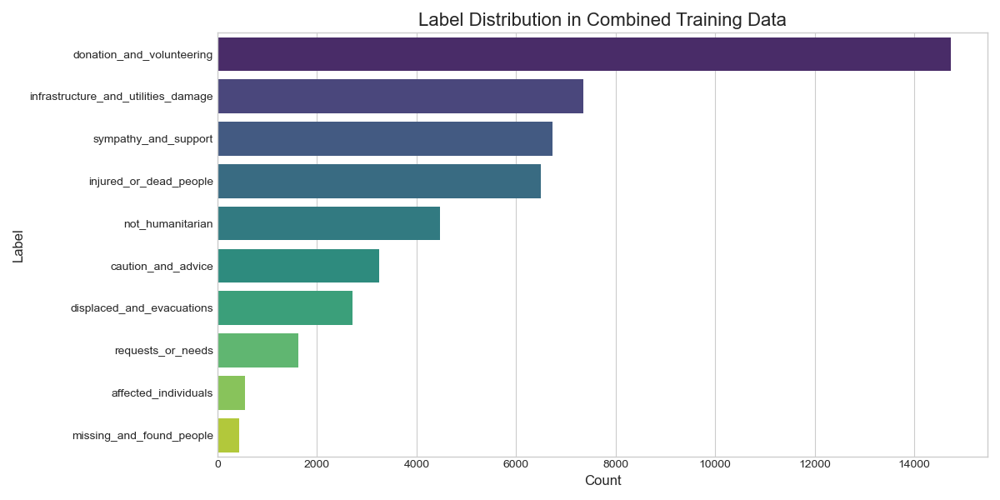
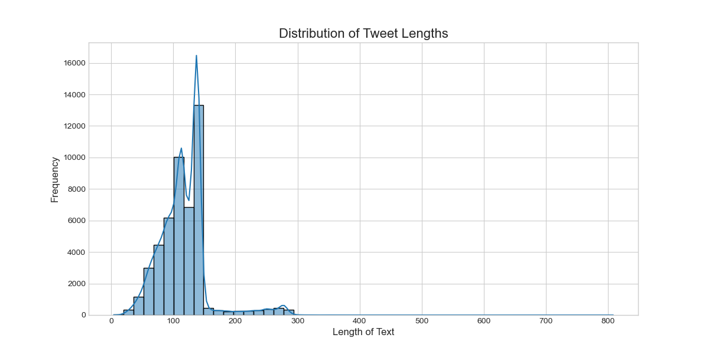

# Exploratory Data Analysis Report: M1 - Disaster Tweets Data

---

### Objective

The objective of this EDA was to analyze the combined and harmonized text datasets (from CrisesNLP and HumanAid) to uncover key characteristics that would inform the data preprocessing and modeling strategy for the M1 NLP Classifier. The analysis focused on understanding class distribution and text length to make data-driven decisions on model evaluation and hyperparameter tuning.

---

### Key Findings & Visualizations

#### 1. Label Distribution & Class Imbalance

**Finding:** The 10 harmonized classes are not equally represented in the training data. The `donation_and_volunteering` category is the most frequent, while `missing_and_found_people` is the rarest. This represents a moderate but realistic class imbalance that must be accounted for.

**Actionable Insights:**
*   A **stratified train/validation split** was implemented to ensure that the class proportions were maintained in both the training and validation sets. This prevents the model from being validated on a skewed distribution.
*   **Weighted F1-score** was chosen as the primary evaluation metric over simple accuracy. This provides a more robust measure of performance on imbalanced data by giving more weight to the F1-scores of under-represented classes.

#### 2. Tweet Length Distribution

**Finding:** The vast majority of text samples are under 200 characters long, with a sharp peak around the 140-character mark. This is highly consistent with the data's origin on microblogging platforms like Twitter.

**Actionable Insights:**
*   This provided a strong, data-driven justification for selecting a `max_length` of **128** for tokenization.
*   This value efficiently captures the full context for the vast majority of samples without adding unnecessary computational overhead from excessive padding. This leads to faster, more efficient model training and inference.

---

### Conclusion

The EDA phase was critical in shaping the development of the NLP classifier. The insights gained led to specific, justified decisions regarding model evaluation metrics (Weighted F1-score) and key hyperparameters (`max_length`). This foundational analysis ensured that the subsequent modeling process was both efficient and methodologically sound.