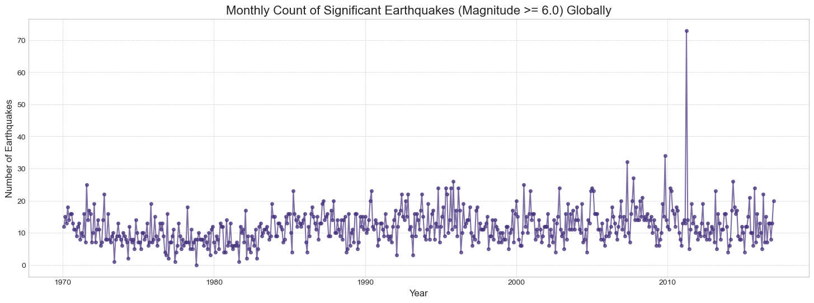

# Exploratory Data Analysis Report: M3 - Earthquake Frequency Data

---

### Objective

The objective of this EDA was to analyze the aggregated monthly earthquake count time series to understand its statistical properties. The analysis focused on identifying trends, seasonality, outliers, and the overall distribution to determine the data's suitability for forecasting with Meta's Prophet model and to establish a baseline understanding of "normal" global seismic activity.

---

### Key Findings & Visualizations

#### 1. Time Series Behavior and Outliers

**Finding:** The time series of monthly significant earthquake counts (Magnitude ≥ 6.0) is highly volatile but appears **stationary** over the long term, fluctuating around a stable average without a clear, sustained upward or downward trend. A dramatic spike is clearly visible around **2011**, which corresponds to the March 2011 Tōhoku earthquake in Japan and its numerous powerful aftershocks.

**Actionable Insights:**
*   The stationary nature of the series makes it an excellent candidate for forecasting models like Prophet, which are designed to decompose such series into trend and seasonality.
*   The 2011 spike was identified as a major outlier. The chosen forecasting model (Prophet) needed to be robust to such events to avoid having its long-term trend skewed by a single anomalous period.

#### 2. Distribution of Monthly Counts

**Finding:** The distribution of monthly counts reveals what a "typical" month of global seismic activity looks like. The **median is 11** significant earthquakes per month, with a mean of 11.79. The distribution is roughly normal but has a slight right skew, pulled by the rare, high-activity months.

**Actionable Insights:**
*   This analysis established a clear numerical baseline for the forecasting task. The model's primary goal is to accurately forecast fluctuations around this central value of approximately 11-12 events per month.
*   This baseline is a critical component of the final dashboard, as it allows users to immediately contextualize real-time data and determine if current activity is normal or anomalous.

---

### Conclusion

The EDA of the earthquake time series was crucial for validating our forecasting approach. It confirmed the data's suitability for a model like Prophet, provided a clear understanding of the baseline activity level to be predicted, and identified a significant outlier that the model needed to handle robustly. This analysis laid the groundwork for building a reliable strategic forecasting tool.