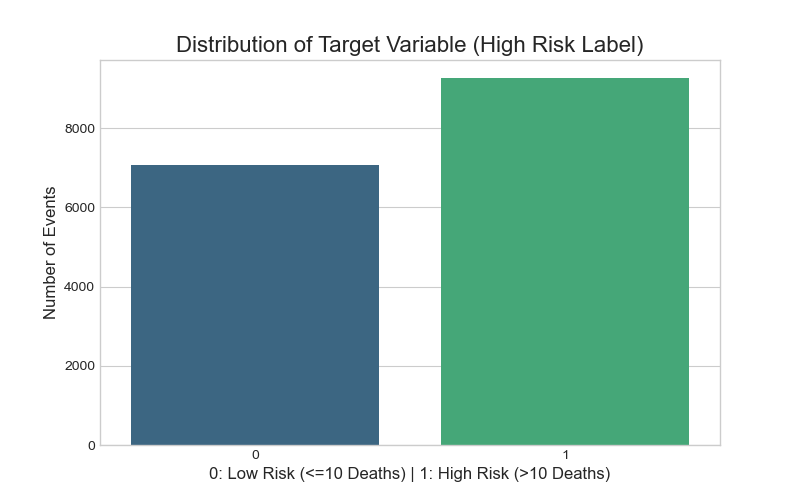
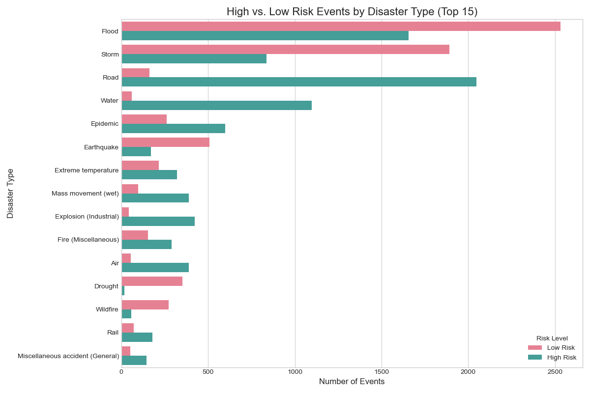
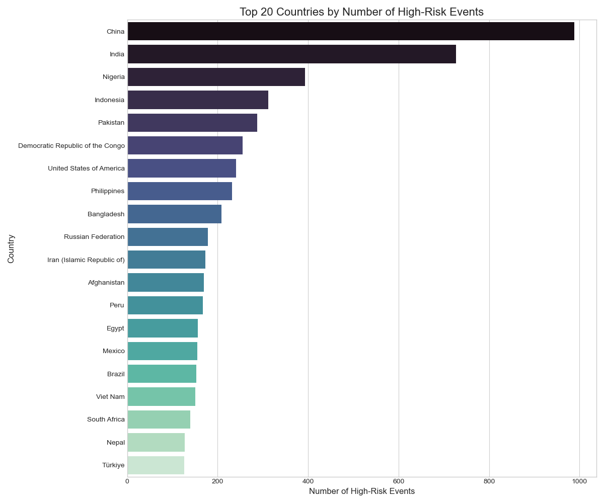

# Exploratory Data Analysis Report: M2 - Disaster Risk Prediction Data

---

### Objective

The objective of this EDA was to analyze the cleaned and feature-engineered EMDAT (Emergency Events Database) to uncover patterns related to disaster risk. The analysis focused on validating the suitability of the selected features (`Disaster Type`, `Country`, etc.) and understanding the distribution of our engineered target variable (`high_risk_label`) before training the M2 Risk Prediction model.

---

### Key Findings & Visualizations

#### 1. Target Variable Distribution

**Finding:** The engineered target variable, `high_risk_label` (where 1 = >10 fatalities), is **well-balanced**. The dataset consists of approximately 57% high-risk events and 43% low-risk events.

**Actionable Insights:**
*   This favorable balance means that complex techniques for handling severe class imbalance (like over-sampling with SMOTE) were not necessary.
*   The model could be trained effectively with a simple adjustment using the `scale_pos_weight` parameter in XGBoost to ensure both classes received appropriate attention.

#### 2. Risk Profile by Disaster Type

**Finding:** The analysis clearly shows that not all disasters carry the same risk. Natural hydrological and meteorological events like **Floods** and **Storms**, along with geophysical events like **Earthquakes**, are predominantly classified as high-risk. In contrast, smaller-scale events like **Road accidents** are almost always low-risk by our fatality-based definition.

**Actionable Insights:**
*   This strongly validated the decision to include `Disaster Type` and `Disaster Group` as key predictive features. The clear differentiation in risk profiles indicated that these features contained a strong predictive signal for the model to learn.

#### 3. Geographic Risk Hotspots

**Finding:** High-risk events are not uniformly distributed globally. They are heavily concentrated in specific geographic hotspots, with countries like **China, India, and Nigeria** accounting for a disproportionately large number of severe disasters in the historical data.

**Actionable Insights:**
*   This confirmed that `Country` and `Region` would be critical features for the model.
*   This finding also directly informed the strategy for the M4 Tactical Forecaster, justifying the selection of specific high-risk Asian countries for a more focused analysis.

---

### Conclusion

The EDA on the EMDAT dataset was instrumental in validating our feature selection and problem framing for the risk prediction task. It confirmed that our chosen features contained strong predictive signals and that our engineered target variable was well-balanced, giving us high confidence to proceed with training the XGBoost model.