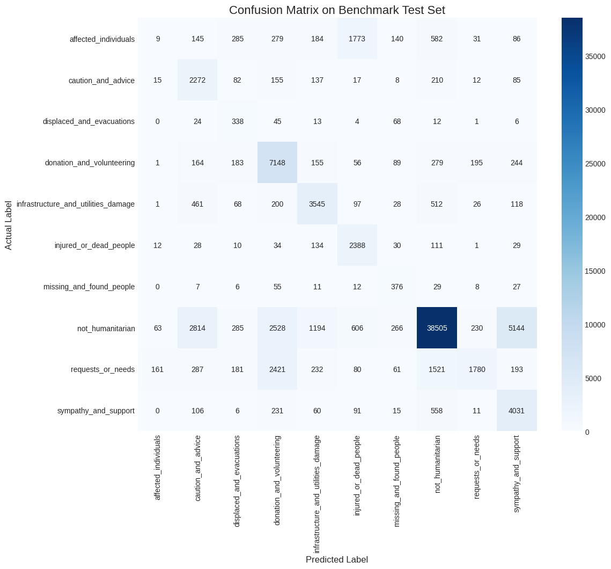

# Model Performance Report: M1 - Disaster Tweet Classifier

---

### Model Summary

| Attribute        | Description                                                               |
| ---------------- | ------------------------------------------------------------------------- |
| **Objective**    | Classify social media text into 10 humanitarian categories.               |
| **Model Type**   | Fine-tuned Transformer (DistilBERT)                                       |
| **Frameworks**   | PyTorch, Hugging Face `transformers`                                      |
| **Training Data**| Combined & harmonized CrisesNLP and HumanAid datasets.                    |

---

### Dataset Overview

*   **Training Set:** A combined corpus of **48,350** text samples after cleaning and harmonization.
*   **Validation Split:** A 20% stratified sample of the training data was used for validation during model training to select the best epoch.
*   **Test Set:** A completely separate, unseen **Benchmark dataset** of **87,557** samples was used for the final evaluation to ensure an unbiased assessment of generalization.

---

### Performance Metrics

The model was evaluated on the unseen Benchmark test set. The primary metric is the **Weighted F1-Score** due to the class imbalance present in the data.

*   **Overall Accuracy:** 69%
*   **Macro Avg F1-Score:** 47%
*   **Weighted Avg F1-Score: 74%**

#### Classification Report

| Class                               | Precision | Recall | F1-Score | Support |
| ----------------------------------- | --------- | ------ | -------- | ------- |
| affected_individuals                | 0.03      | 0.00   | 0.00     | 3,514    |
| caution_and_advice                  | 0.36      | 0.76   | 0.49     | 2,993    |
| displaced_and_evacuations           | 0.23      | 0.66   | 0.35     | 511     |
| donation_and_volunteering           | 0.55      | 0.84   | 0.66     | 8,514    |
| infrastructure_and_utilities_damage | 0.63      | 0.70   | 0.66     | 5,056    |
| injured_or_dead_people              | 0.47      | 0.86   | 0.60     | 2,777    |
| missing_and_found_people            | 0.35      | 0.71   | 0.47     | 531     |
| not_humanitarian                    | 0.91      | 0.75   | 0.82     | 51,635   |
| requests_or_needs                   | 0.78      | 0.26   | 0.39     | 6,917    |
| sympathy_and_support                | 0.40      | 0.79   | 0.53     | 5,109    |

---

### Visualizations & Analysis

#### Confusion Matrix on Benchmark Test Set

#### Analysis

*   **Strengths:**
    *   The model shows **excellent performance in noise filtration**, correctly identifying the `not_humanitarian` class with 91% precision. This is critical for the platform's primary goal.
    *   It achieves **high recall** on several key, high-volume categories like `donation_and_volunteering` (84%) and `injured_or_dead_people` (86%), meaning it successfully captures the majority of these important posts.

*   **Weaknesses:**
    *   The model's most significant weakness is its **poor recall (26%) on `requests_or_needs`**. It frequently misclassifies these urgent pleas for help as other categories, which is a top priority for future improvement.
    *   It completely fails to generalize on rare classes like `affected_individuals`, likely due to the low number of training examples and semantic ambiguity.

---

### Conclusion

The DistilBERT classifier is a robust and effective foundational model for the platform. It successfully performs the critical task of filtering noise and identifying major event types. While its performance on certain rare or nuanced classes needs improvement, it provides a strong baseline and a valuable "first-pass filter" for the DisasterInsight AI system.