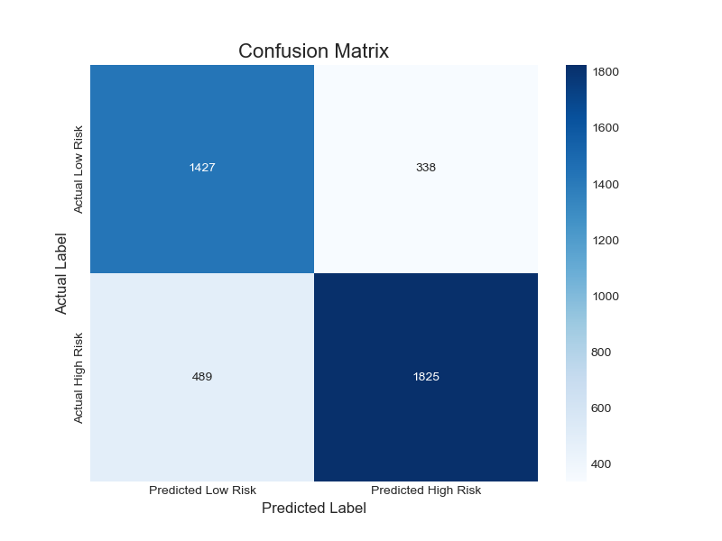
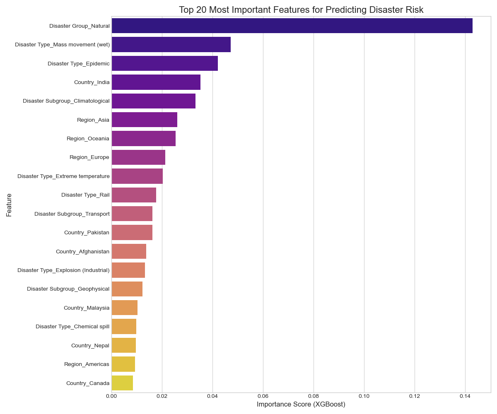

# Model Performance Report: M2 - Static Disaster Risk Predictor

---

### Model Summary

| Attribute        | Description                                                               |
| ---------------- | ------------------------------------------------------------------------- |
| **Objective**    | Predict if a disaster will be "high-impact" (>10 deaths) based on its features. |
| **Model Type**   | XGBoost Classifier within a Scikit-learn Pipeline                         |
| **Frameworks**   | Scikit-learn, XGBoost                                                     |
| **Training Data**| EMDAT International Disaster Database.                                    |

---

### Dataset Overview

*   **Source Data:** The model was trained on **16,315** historical disaster event records from the EMDAT database.
*   **Features:** A set of 7 features were selected, including `Disaster Group`, `Disaster Type`, `Country`, `Region`, `Start Year`, and `Start Month`.
*   **Target Engineering:** A binary target, `high_risk_label`, was created where `1` represents an event with > 10 fatalities. The resulting dataset was well-balanced (57% high-risk, 43% low-risk).
*   **Train/Test Split:** The data was split into a **75% training set** and a **25% test set** using a stratified split to preserve class proportions.

---

### Performance Metrics

The model was evaluated on the unseen test set of **4,079** events.

*   **Overall Accuracy:** 80%
*   **ROC-AUC Score: 0.87**

#### Classification Report

| Class         | Precision | Recall | F1-Score | Support |
| ------------- | --------- | ------ | -------- | ------- |
| Low Risk (0)  | 0.74      | 0.81   | 0.78     | 1,765   |
| High Risk (1) | 0.84      | 0.79   | 0.82     | 2,314   |

---

### Visualizations & Analysis

#### Confusion Matrix

*   **Analysis:** The model demonstrates a balanced ability to identify both classes. It successfully flagged **1,825** of the 2,314 true high-risk events (79% recall), while maintaining a low number of "false alarms" (338 false positives).

#### Feature Importance

*   **Analysis:** This is the most valuable output. The model learned that:
    1.  The fundamental **nature of the disaster** (`Disaster Group_Natural`) is the single most important predictor.
    2.  **Specific disaster types** like `Mass movement (wet)` (landslides) carry exceptionally high risk.
    3.  **Geography is a critical co-factor**, with events in `Country_India` and the broader `Region_Asia` being strong indicators of potential high impact.

---

### Conclusion

The XGBoost Risk Predictor is a high-performance and, crucially, **explainable** model. With a ROC-AUC of 0.87, it effectively distinguishes between high and low-risk events. Its feature importance analysis provides deep, data-driven insights into the primary factors that constitute disaster risk on a global scale, making it a powerful tool for strategic planning.