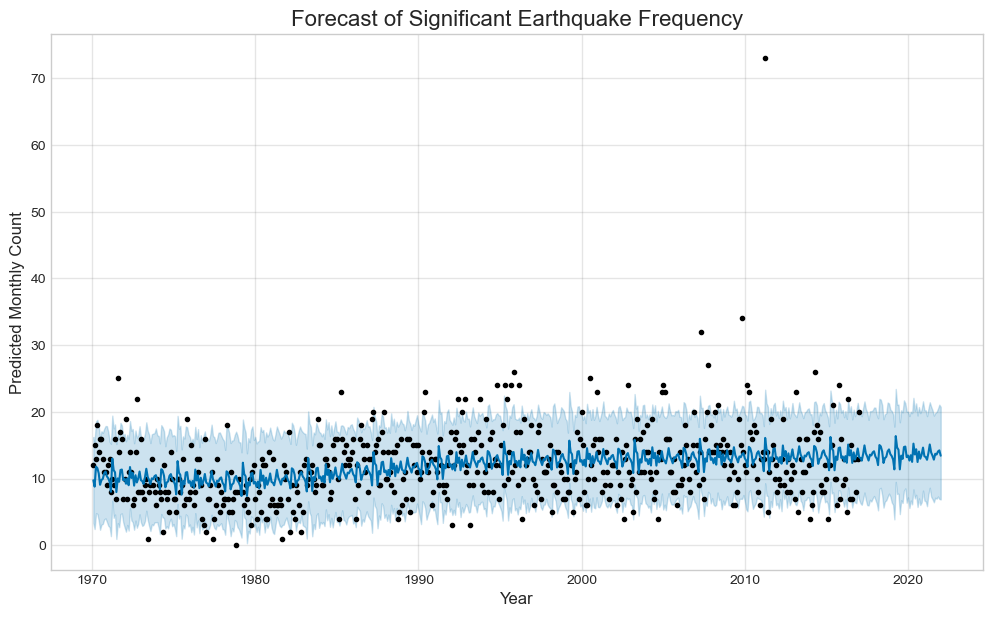
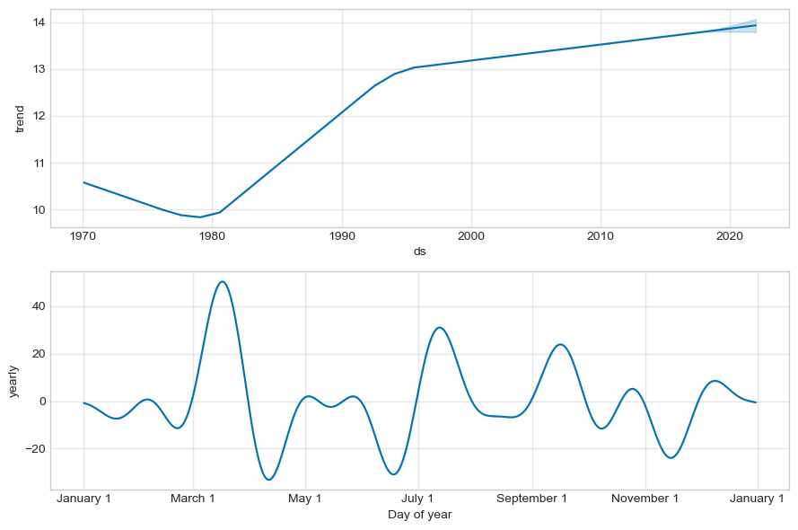

# Model Performance Report: M3 - Global Earthquake Frequency Forecaster

---

### Model Summary

| Attribute        | Description                                                               |
| ---------------- | ------------------------------------------------------------------------- |
| **Objective**    | Forecast the global monthly frequency of significant (Magnitude ≥ 6.0) earthquakes. |
| **Model Type**   | Time-Series Forecasting Model                                             |
| **Frameworks**   | Meta's Prophet                                                            |
| **Training Data**| USGS Earthquake Database (1970-2016).                                     |

---

### Dataset Overview

*   **Source Data:** A log of historical earthquakes from the USGS.
*   **Target Engineering:** The raw data was filtered to include only **7,354** events with a magnitude of 6.0 or greater. These events were then aggregated to create a time series of **monthly counts** spanning 564 months (from 1970 to 2016).

---

### Performance Metrics

Standard classification metrics do not apply. The model's performance was rigorously evaluated using **time-series cross-validation**, which simulates forecasting over different historical periods.

*   **Primary Metric:** Mean Absolute Error (MAE)
*   **MAE Result: 4.33 earthquakes per month**

**Interpretation:** This metric provides a clear and honest measure of the forecast's accuracy. We can state with confidence that our monthly forecast is, on average, expected to be **within ~4 earthquakes** of the actual historical count. For a volatile, global phenomenon, this level of accuracy provides a strong and useful baseline for strategic planning.

---

### Visualizations & Analysis

#### Forecast vs. Actuals

*   **Analysis:** The model successfully captures the typical range of monthly earthquake frequency, predicting a baseline of approximately 14 events per month. The forecast correctly identifies major spikes, like the 2011 Tōhoku event, as outliers, demonstrating its robustness.

#### Trend and Seasonality Components

*   **Analysis:**
    1.  **Trend:** The model identified a significant long-term trend: a slight decrease in events until the late 1970s, followed by a **slow but persistent increase**. This is a critical insight, likely reflecting the global expansion and improvement of seismic monitoring technology rather than a change in geological activity.
    2.  **Seasonality:** A weak but consistent yearly pattern was detected, with a statistical peak in seismic activity around the **March-April period**.

---

### Conclusion

The Prophet model is a highly effective strategic forecasting tool. It successfully establishes a "normal" level of global seismic activity with a quantified error margin. **Crucially, this is NOT an earthquake prediction tool for specific events.** It is a baseline model that allows the DisasterInsight platform to identify statistically anomalous periods of global activity.