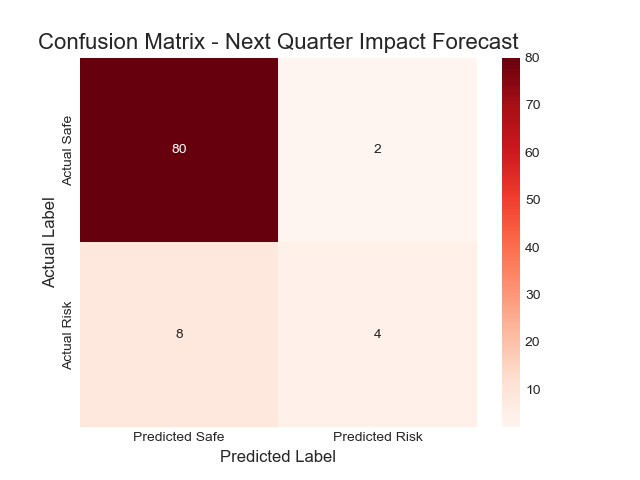
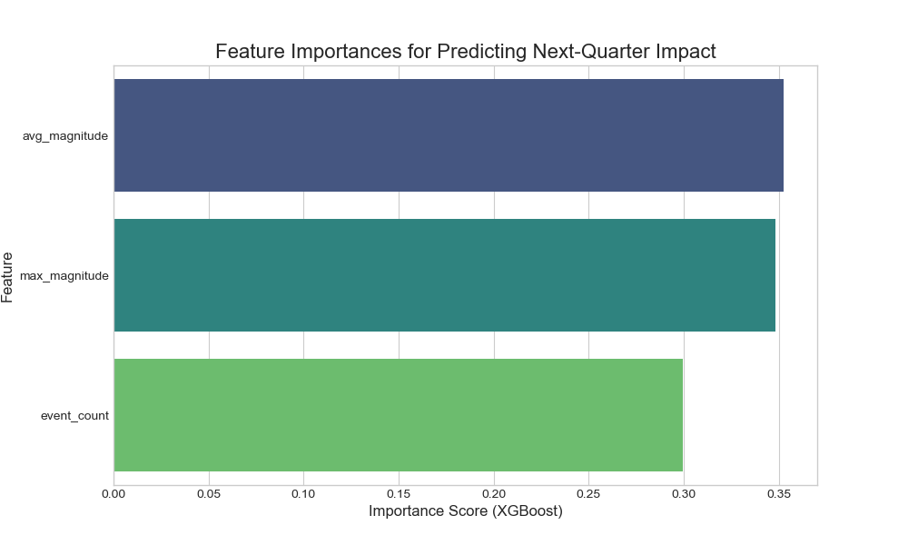

# Model Performance Report: M4 - Tactical Regional Impact Forecaster

---

### Model Summary

| Attribute        | Description                                                               |
| ---------------- | ------------------------------------------------------------------------- |
| **Objective**    | Predict the probability of a fatal earthquake in the **next quarter** for specific high-risk regions. |
| **Model Type**   | XGBoost Classifier on engineered time-series features.                    |
| **Frameworks**   | Scikit-learn, XGBoost                                                     |
| **Training Data**| Filtered EMDAT data for earthquakes in China, India, Indonesia, and the Philippines. |

---

### Dataset Overview

*   **Source Data:** A focused subset of **229** earthquake events from the EMDAT database.
*   **Feature Engineering:** This was the core of the task. The event log was transformed into a quarterly time series. For each of the 4 countries, each quarter became a row with features summarizing that period's activity: `event_count`, `max_magnitude`, and `avg_magnitude`.
*   **Target Engineering:** A "lead" target variable was created, where the features from one quarter are used to predict the outcome (occurrence of a fatal event) in the **subsequent quarter**.
*   **Train/Test Split:** A **chronological split** was used, with the first 75% of the timeline as the training set and the final 25% as the test set to simulate a real-world forecasting scenario.

---

### Performance Metrics

The model was evaluated on the most recent 25% of the data (94 quarters).

*   **Overall Accuracy:** 89%
*   **ROC-AUC Score:** 0.65

#### Classification Report

| Class                             | Precision | Recall | F1-Score | Support |
| --------------------------------- | --------- | ------ | -------- | ------- |
| No High-Impact Event Next Quarter | 0.91      | 0.98   | 0.94     | 82      |
| High-Impact Event Next Quarter    | 0.67      | 0.33   | 0.44     | 12      |

---

### Visualizations & Analysis

#### Confusion Matrix

*   **Analysis:** The key insight is the trade-off between precision and recall. The model is a **"conservative alarm"**.
    *   **High Precision (67%):** When the model predicts a high-impact quarter, it is correct two out of three times. This makes its alerts reliable and worthy of attention.
    *   **Low Recall (33%):** It only identifies one-third of the truly risky upcoming quarters, meaning it will miss many events. A "safe" prediction does not guarantee safety.

#### Feature Importance

*   **Analysis:** The model gives nearly equal weight to all three engineered features. This is a powerful finding, indicating that **no single indicator is enough** to predict future risk. A holistic view of the frequency (`event_count`), average intensity (`avg_magnitude`), and peak intensity (`max_magnitude`) of the current quarter's seismic activity is the best predictor of a fatal event in the next quarter.

---

### Conclusion

The Regional Impact Forecaster is a successful proof-of-concept for a tactical, proactive warning system. It provides a reliable, high-confidence (though not comprehensive) signal that can be a vital component of a proactive disaster response strategy for the four target regions. Its value lies in its high precision, making its alerts highly actionable.