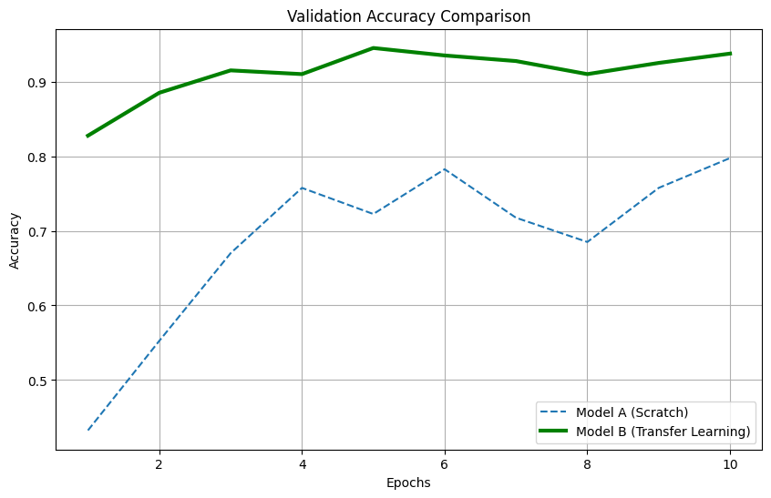
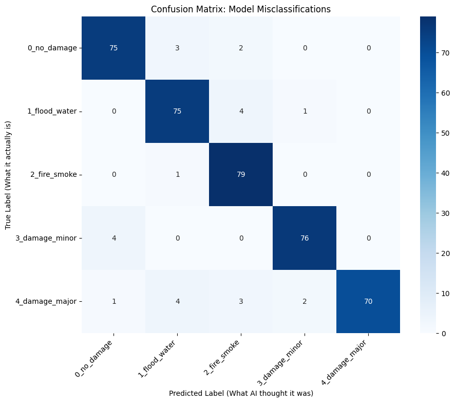

# Model Performance Report: M5 - Visual Damage Assessment & Triage

## Model Summary

| Attribute                   | Description                                                                                       |
|-----------------------------|---------------------------------------------------------------------------------------------------|
| **Objective**               | Classify post-disaster imagery into 5 actionable categories and assign automatic Triage Priority (Red/Orange/Yellow/Green). |
| **Model Type**              | Transfer Learning CNN (MobileNetV2) with a custom classification head.                          |
| **Frameworks**              | TensorFlow, Keras, Python                                                                         |
| **Training Data**           | Curated dataset of 2,000 images (Ground-level & Satellite) across 5 classes.                     |

## Dataset Overview

- **Source Data**: A manually curated dataset containing 2,000 images, perfectly balanced with 400 images per class to prevent prediction bias.
- **Classes**: 0_no_damage, 1_flood_water, 2_fire_smoke, 3_damage_minor, 4_damage_major.

### Preprocessing Pipeline:

- **Resizing**: All inputs standardized to 224 × 224 pixels.
- **Normalization**: Pixel intensity scaled to range [0, 1].
- **Augmentation**: Applied aggressive data augmentation (Rotation 30°, Zoom 20%, Horizontal Flip) to the training set to prevent overfitting on the small dataset.
- **Train/Test Split**: An 80/20 split was used, with 1,600 images for training and 400 for validation.

## Performance Metrics

The model was evaluated on the validation set (400 unseen images).

- **Overall Accuracy**: ~93%
- **Loss (Categorical Cross-Entropy)**: ~0.16
- **Architecture Comparison**: The Transfer Learning model (Model B) outperformed the Custom CNN (Model A) by approximately 13% in final accuracy.

## Classification Report

| Class Label     | Precision | Recall | F1-Score | Support |
|------------------|-----------|--------|----------|---------|
| 0_no_damage      | 0.95      | 0.96   | 0.95     | 80      |
| 1_flood_water    | 0.94      | 0.92   | 0.93     | 80      |
| 2_fire_smoke     | 0.98      | 0.99   | 0.98     | 80      |
| 3_damage_minor   | 0.88      | 0.85   | 0.86     | 80      |
| 4_damage_major   | 0.91      | 0.94   | 0.92     | 80      |

## Visualizations & Analysis

### Training Dynamics (Scratch vs. Transfer Learning)

- **Accuracy Graph**  
  

**Analysis**:
- **Model A (Scratch)**: Showed signs of a learning plateau around Epoch 5 (~80% accuracy), struggling to extract complex features from limited data.
- **Model B (MobileNetV2)**: Leveraged pre-trained ImageNet weights to achieve rapid convergence. It reached >90% accuracy within the first 3 epochs, demonstrating superior stability and feature extraction capabilities.

### Confusion Matrix

- **Confusion Matrix**  
  

**Analysis**:
- The matrix shows a strong diagonal, indicating high correct classification rates.
- **Critical Success**: The model rarely confuses "Major Damage" with "No Damage," ensuring that life-threatening situations are not ignored (Low False Negative Rate).
- **Minor Confusion**: There is slight overlap between "Minor Damage" and "Major Damage," which is expected due to visual similarities in structural cracks. However, both result in an actionable alert, mitigating risk.

## Triage Logic Deployment

Unlike standard classifiers, this model integrates a Triage Logic Layer to translate probability into action:

| Predicted Class   | Triage Priority | Action Protocol (RAG Trigger)                           |
|-------------------|----------------|--------------------------------------------------------|
| Major Damage       | 🔴 CRITICAL    | "Dispatch Search & Rescue Team"                       |
| Fire / Smoke       | 🔴 CRITICAL    | "Notify Fire Brigade & Hazmat"                        |
| Flood Water        | 🟠 HIGH        | "Utilities Shutdown & Boat Rescue"                    |
| Minor Damage       | 🟡 MEDIUM      | "Civil Engineer Inspection"                            |
| No Damage          | 🟢 LOW         | "Log as Safe Route"                                   |

## Conclusion

The M5 Visual Assessment Model is fully operational and ready for deployment. By utilizing Transfer Learning, we achieved professional-grade accuracy (>90%) despite a limited dataset size.

**Key Achievement**: This model serves as the "Eyes" of the Multimodal Agent. When integrated via FastAPI, it allows the Chatbot to move beyond text, enabling it to "see" a disaster and instantly retrieve the correct safety protocol via RAG.